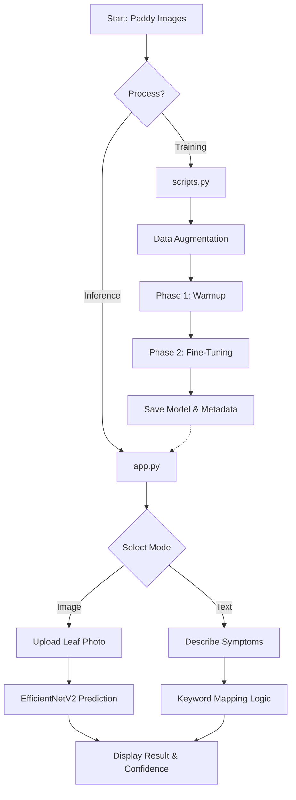

# 🌾 Paddy Guard: Disease Classification

Paddy Guard is a premium AI-powered system designed to classify rice leaf diseases using both Image recognition and symptom-based text analysis. Built with **EfficientNetV2B2** and **Streamlit**, it provides a robust and user-friendly interface for farmers and researchers to monitor paddy health.

## 🚀 Technologies Used
- **Core**: Python 3.x
- **Deep Learning**: TensorFlow, Keras (EfficientNetV2B2 Architecture)
- **Data Handling**: Pandas, NumPy
- **Preprocessing**: PIL (Pillow), Scikit-Learn
- **Web Interface**: Streamlit (Premium UI)
- **Serialization**: Pickle

## 📊 Dataset
The project utilizes the **Paddy Disease Classification** dataset from Kaggle.
- **Source**: [Kaggle - Paddy Disease Classification](https://www.kaggle.com/competitions/paddy-disease-classification)
- **Scope**: Includes thousands of images across 10 classes (9 diseases + 1 normal).

## 📁 Project Structure
```text
paddy classification/
├── app.py                      # Main Streamlit Web Application
├── scripts.py                  # Model Training & Fine-tuning Script
├── final_paddy_model.keras     # Saved Trained Model
├── best_paddy_model.keras      # Best Validation Checkpoint
├── paddy_model_metadata.pkl    # Label Mappings & Metadata
├── train.csv                   # Training Metadata
├── sample_submission.csv       # Submission Template
├── train_images/               # Labeled Dataset Folders
└── test_images/                # Unlabeled Testing Images
```

## 🔄 Workflow Flowchart


## 🧠 Code Logic

### 1. Training Pipeline (`scripts.py`)
- **Architecture**: Leverages **EfficientNetV2B2** for superior image classification.
- **Augmentation**: Flips, rotations, zooms, and contrast adjustments to prevent overfitting.
- **Class Weighting**: Balanced weights handle dataset imbalances for rare diseases.
- **Two-Phase Training**:
    - **Warmup**: Trains custom top layers while the base model stays frozen.
    - **Fine-Tuning**: Unfreezes the base model for deep neural refinement.

### 2. Web Application (`app.py`)
- **📸 Image Upload**: Resizes and processes photos for high-precision DL inference.
- **✍️ Symptom Description**: Maps user input (e.g., "neck rot", "water-soaked") to diseases.
- **🎲 Random Sampling**: Quickly tests the system with pre-loaded test data.
- **Premium UI**: Card-based results with animations and clear visual feedback.

## 🚀 How to Run

### Training the Model
```bash
python scripts.py
```

### Running the Web App
```bash
streamlit run app.py
```

---
*Developed for Paddy Health Monitoring & Classification*
